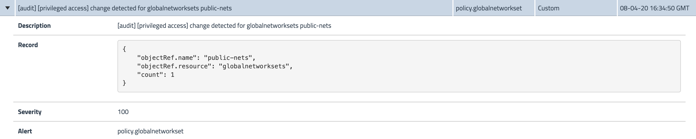

# calico-security-controls-for-k8s

This guide contains example demo scenarios to showcase security controls for Kubernetes using Calico.

## high level topics

- Kubernetes (k8s) network policies and Calico network policies
- Default deny policy
- Kubernetes RBAC
- Calico security controls: `tiers`, `network policies`, `network sets`, `threat feeds`, `alerts`, `compliance reports`
- Intrusion and threat detection\

## Deploy demo application

The examples in this guide use demo applications in `./app` directory. Each demo app stack is comprised of `nginx` deployment and a utility pod (e.g. `centos` or `netshoot`) that continuously `curl`s the `nginx` service.

Deploy the demo app stacks.

```bash
kubectl apply -f app/ns1/
kubectl apply -f app/ns2/
```

## Network policies

Kubernetes [network policies](https://kubernetes.io/docs/concepts/services-networking/network-policies/#networkpolicy-resource) are namespace scoped, support rules to control traffic direction (i.e. `ingress/egress`), and use labels to dynamically apply policies to `Pods`.

Calico [network policies](https://docs.tigera.io/security/calico-network-policy) extend k8s network policies with additional capabilities like global scope, policy ordering controls, rule actions (i.e. `Allow`, `Deny`, `Log`, `Pass`), DNS policies, policy tiers, policy preview and staging, and other fine-grained policy controls.

A common security practice is to only open access required by applications and services running in k8s cluster. This can be achieved by deploying a `default-deny` policy for each namespace when using k8s network policies.

Deploy k8s `default-deny` policy that applies to `ns1` namespace.

```bash
# deploy policy
kubectl apply -f demo/10-k8s-n-calico-policy/k8s.deny-all.yaml

# test nginx access in ns1
kubectl -n ns1 exec -t centos -- sh -c 'SVC=nginx-svc; curl -m 5 -sI http://$SVC 2>/dev/null | grep -i http'
# test nginx access in ns2
kubectl -n ns2 exec -t netshoot -- sh -c 'SVC=nginx-svc; curl -m 5 -sI http://$SVC 2>/dev/null | grep -i http'
```

Deploy Calico global policy to allow k8s DNS access

```bash
# deploy policy
kubectl apply -f demo/10-k8s-n-calico-policy/calico.allow-kube-dns.yaml
```

Deploy k8s policy to allow `centos` access `nginx`

```bash
# deploy policy
kubectl apply -f demo/10-k8s-n-calico-policy/k8s.allow-nginx-ingress.yaml
```

One of the advantages of Calico policies is the ability to set a `Global` scope for the policy which will ensure its application to all of the namespaces in k8s cluster.

Deploy Calico global `default-deny` policy.

```bash
# deploy policy
kubectl apply -f demo/10-k8s-n-calico-policy/calico.deny-all.yaml

# test nginx access in ns2
kubectl -n ns2 exec -t netshoot -- sh -c 'SVC=nginx-svc; nslookup $SVC; curl -m 5 -sI http://$SVC 2>/dev/null | grep -i http'
```

Deploy Calico policy to allow `netshoot` access to `nginx` service.

```bash
# deploy policy
kubectl apply -f demo/10-k8s-n-calico-policy/calico.allow-nginx-ingress.yaml
```

Deploy logging policy to capture `nginx` pod access

```bash
# deploy logging policy
kubectl apply -f demo/10-k8s-n-calico-policy/calico.log-access.yaml

# SSH into the host that runs nginx pod from ns1 namespace
# view access trace for nginx pod
tail -f /var/log/kern.log | grep -i calico
```

## Kubernetes RBAC

Kubernetes RBAC model uses `subjects` to execute `operations` over `resources`. While `subject` can be a `User`, `Group`, or `Service Account`, the former two are managed outside of Kubernetes and referenced by a string ID. In this guide `Service Account` subjects will be used for RBAC examples.


Create two `Service Accounts` and configure `Role` and `RoleBinding` for each account

```bash
# configure 'paul' service account - has full admin access
kubectl create sa paul
# configure role and rolebinding
kubectl create clusterrolebinding paul-admin-access --clusterrole tigera-network-admin --serviceaccount default:paul

# configure 'sally' service account - has limited access
kubectl create sa sally
# configure role and rolebinding
kubectl create -f demo/20-rbac/security-roles-rolebindings.yaml

# deploy additional role and rolebinding to allow sally access k8s net policies
kubectl create -f demo/20-rbac/k8s.net-policy-access-roles-rolebindings.yaml
```

Retrieve token to login into Calico Enterprise Manager.

```bash
SA='sally'
# get service account token
kubectl get secret $(kubectl get serviceaccount $SA -o jsonpath='{range .secrets[*]}{.name}{"\n"}{end}' | grep token) -o go-template='{{.data.token | base64decode}}'
```

## Networks Sets

Calico offers `NetworkSets` and `GlobalNetworkSets` resources to apply security controls to a group of IPs or DNS names.

Deploy a `GlobalNetworkSet` that represents public networks and policy that targets it.

```bash
# deploy netset
kubectl apply -f demo/30-netsets/calico.public-nets.yaml
# deploy policy
kubectl apply -f demo/30-netsets/calico.deny-public-nets-egress.yaml

# test centos pod access to public IPs
PUB_IP=$(dig +short www.apple.com | tail -n1)
kubectl -n ns1 exec -t centos -- sh -c "ping -c3 $PUB_IP"
kubectl -n ns1 exec -t centos -- sh -c 'curl -m 5 -sI http://www.google.com 2>/dev/null | grep -i http'
```

## Policy tiers

Calico Enterprise provides policy tiers that allow to categorize the policies. For instance, by team function or organizational structure.

Deploy `security` policy tier and move `log-access` policy into it.

```bash
# deploy tier
kubectl apply -f demo/30-tier/tier-security.yaml

# deploy log-access policy into security tier
kubectl apply -f demo/30-tier/calico.log-access.yaml
```

## DNS policy

Calico DNS policies allow to control egress using DNS names. The DNS names could be either directly specified in the policy or in a network set resource.

Deploy DNS policy.

```bash
# deploy policy
kubectl apply -f demo/50-dns-policy/calico.allow-dns-egress.yaml

# test centos pod access to google DNS
# egress to Google DNS should be allowed
kubectl -n ns1 exec -t centos -- sh -c 'curl -m 5 -sI http://www.google.com 2>/dev/null | grep -i http'
# egress to Apple DNS should be denied
kubectl -n ns1 exec -t centos -- sh -c 'curl -m 5 -sI http://www.apple.com 2>/dev/null | grep -i http'
```

## Global alerts

Calico provides alerting capability based on `flow logs`, `audit logs`, and `DNS logs`.

Deploy a `GlobalAlert` that watches any changes to `NetworkSets`.

```bash
# deploy global alert
kubectl apply -f demo/60-globalalerts/galert.policy.globalnetworkset.yaml

# change existing global network set, then check alerts UI in Calico Enterprise Manager
sed -e '/1.0.0.0\/8/{d;}' demo/30-netsets/calico.public-nets.yaml | kubectl apply -f -
```


